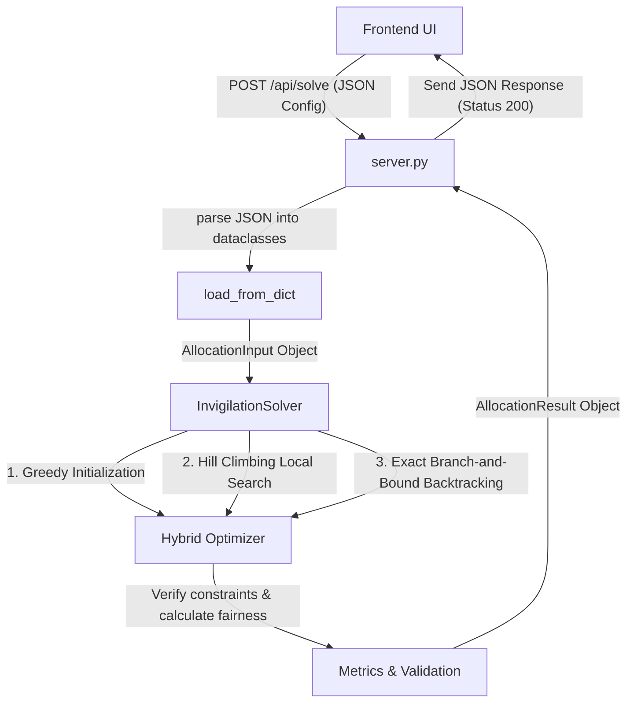
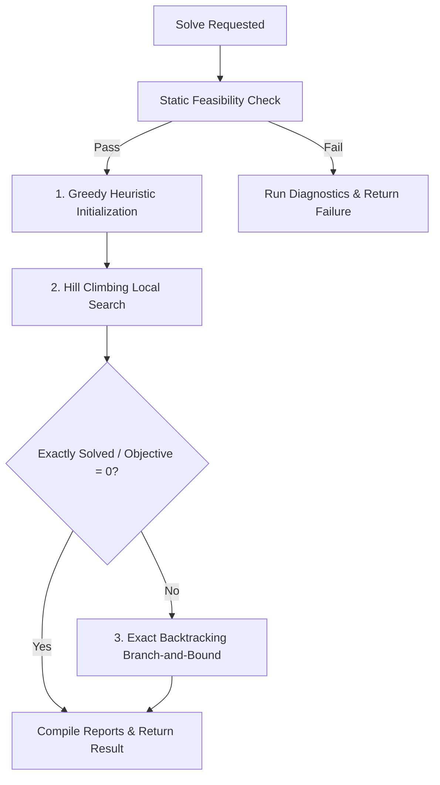

# Technical Walkthrough of the Python Backend

This document provides a detailed, block-by-block, and line-by-line explanation of the core backend codebase: [invigilation_scheduler.py](file:///c:/Users/Ayush/OneDrive/Desktop/IIT%20Bombay/invigilation_scheduler.py) and [server.py](file:///c:/Users/Ayush/OneDrive/Desktop/IIT%20Bombay/server.py). 

---

## 1. System Architecture & Flow

The backend operates as a self-contained REST API server that solves a highly constrained optimization problem: **fairly scheduling exam invigilation duties to faculty members.**



---

## 2. Block-by-Block Walkthrough: `invigilation_scheduler.py`

### Block 1: Data Models & Imports (Lines 1–88)
This section imports necessary packages and uses Python's `@dataclass` decorator to define structured type-safe objects representing the problem domain.

*   `enum` is used to represent the type of exam (`MIDSEM` or `ENDSEM`), which determines if PG (Postgraduate) class conflicts apply.
*   `@dataclass` eliminates boilerplates like `__init__` and `__repr__`.

```python
# Models mapping the problem domain:
class ExamType(str, enum.Enum):
    MIDSEM = "midsem"
    ENDSEM = "endsem"

@dataclass
class FacultyCategory:
    name: str          # e.g., "Professor", "Associate Professor"
    ratio_weight: float # Target workload multiplier (e.g. 2.0, 3.0, 4.0)

@dataclass
class Faculty:
    id: str
    name: str
    category_name: str
    pg_timetable_blocks: List[str] = field(default_factory=list)  # Conflict slots (midsem only)
    availability_overrides: List[str] = field(default_factory=list) # Slots marked unavailable

@dataclass
class Session:
    id: str                   # e.g., "D11" (Day 1 Session 1)
    day: int                  # 1 (Monday) to 6 (Saturday)
    session_num: int          # 1 (Forenoon - FN) or 2 (Afternoon - AN)
    label: str                # e.g. "Monday FN"
    required_invigilators: int
    day_weight: float = 1.0   # Weekdays = 1.0, Saturday = 1.5 (heavier penalty/credit)
    duration_hours: float = 2.0

@dataclass
class HistoricalRecord:
    faculty_id: str
    previous_imbalance: float  # +n hours (overloaded previously), -m hours (underloaded)
```

> [!NOTE]
> **Interviewer Hook**: By modeling inputs using standard Python `dataclass` types, we separate raw data parsing from solver logic, making the code clean, modular, and easy to unit test.

---

### Block 2: Workload & Fairness Metrics (Lines 90–196)

To balance workloads fairly, we must compute **Target Load** for each faculty and use statistical metrics to measure inequality.

#### Target Load Calculation
The method `calculate_target_loads` computes the number of weighted hours each faculty member *ought* to work. It supports three modes:
1.  `target_load_scaling`: Scaled category ratio weights so the sum of targets matches the exact required exam hours.
2.  `raw_weights`: Categorical weights are treated as raw target hours.
3.  `hard_category_limits`: The scaled targets are treated as hard maximum limits.

#### Jain's Fairness Index
This is a standard statistical metric used in computer networking to evaluate resource allocation fairness.
$$\text{Jains Index} = \frac{\left( \sum_{i=1}^{n} x_i \right)^2}{n \cdot \sum_{i=1}^{n} x_i^2}$$
where $x_i = \frac{\text{Actual Load}_i}{\text{Target Load}_i}$.
*   **Result range**: Between $\frac{1}{n}$ (worst case) and $1.0$ (perfect fairness).

```python
def calculate_jains_index(loads: List[float], targets: List[float]) -> float:
    n = len(loads)
    if n == 0: return 1.0
    
    ratios = [l / t if t > 0 else (1.0 if l == 0 else 0.0) for l, t in zip(loads, targets)]
    sum_ratios = sum(ratios)
    if sum_ratios == 0: return 1.0
    
    sum_sq_ratios = sum(x ** 2 for x in ratios)
    return (sum_ratios ** 2) / (n * sum_sq_ratios)
```

#### Gini Coefficient
A standard economic metric measuring inequality of a distribution.
$$\text{Gini} = \frac{\sum_{i=1}^n \sum_{j=1}^n |x_i - x_j|}{2 \cdot n \cdot \sum_{i=1}^n x_i}$$
*   **Result range**: $0.0$ (perfect equality) to $1.0$ (perfect inequality).

---

### Block 3: Constraint Validation & Diagnostics (Lines 237–441)

The solver enforces **hard constraints** and diagnoses infeasibility if no schedule can satisfy them.

```python
def _is_faculty_eligible_for_session(self, fac_id: str, session: Session, current_load: float, ...) -> bool:
```
This validates three crucial criteria:
1.  **PG conflicts**: Suspends assignment if `ExamType == ExamType.MIDSEM` and the session overlaps with a faculty's PG lecture.
2.  **Availability overrides**: Checks if the faculty explicitly marked themselves unavailable.
3.  **Hard Category Limits**: If in limit mode, ensures adding this session does not push them past their calculated target.

#### Static Feasibility Engine (`check_feasibility`)
Statically determines if a valid schedule is mathematically possible before invoking the search engine:
*   *Check 1*: Does each session have enough eligible faculty?
*   *Check 2*: Is the daily unique faculty count sufficient? (Since each faculty is restricted to **at most one duty per day**, a day requiring 6 slots must have $\ge 6$ unique available faculty).

#### Relaxation Diagnostics (`run_diagnostics`)
If the problem is infeasible, this function dynamically relaxes constraints one-by-one to pinpoint the exact failure cause (e.g., suspends PG conflicts, suspends overrides, or checks daily limits) to report a meaningful error back to the user.

---

### Block 4: The Core Solver Engine (Lines 442–803)

The solver uses a **hybrid optimization strategy** combining heuristics, local search, and exact methods to guarantee optimal results efficiently.



#### Objective Function (`_get_objective`)
The goal is to minimize a combined penalty score:
$$\text{Objective} = \sum_{f} (\text{History}_f + \text{Actual Load}_f - \text{Target Load}_f)^2 + \sum_{f} \text{Worsening Penalty} + \text{Unfilled Slots} \times 100,000$$
*   **Quadratic load deviation**: Penalizes deviations from target quadratically. This naturally pushes workloads to remain near their targets.
*   **Worsening penalty**: If a faculty member has a historical imbalance ($H_f$), making their imbalance *worse* is heavily penalized ($100\times$).
*   **Unassigned slot penalty**: Prevents the optimizer from leaving sessions unstaffed.

#### Step 1: Greedy Heuristic Initialization (`_run_greedy_initialization`)
This constructs a quick initial solution.
*   **MRV Heuristic (Minimum Remaining Values)**: Sessions are sorted such that Saturday sessions and those with the fewest eligible faculty members are allocated first.
*   **Least Cost Selection**: For each slot, faculty members are sorted by their current load deviation. The one whose assignment minimizes the cumulative load deviation is selected.

#### Step 2: Hill Climbing Local Search (`_run_local_search`)
Runs for 20,000 iterations to optimize the greedy schedule by randomly selecting one of three structural moves:
1.  `swap_faculty`: Swaps an assigned faculty member in a session with an eligible unassigned faculty member.
2.  `swap_sessions`: Swaps duties between two faculty members across two different sessions.
3.  `fill_unassigned`: Tries to assign an eligible faculty member to a vacant slot.
Any move that decreases the objective function is kept.

#### Step 3: Exact Backtracking Branch-and-Bound (`backtrack`)
If local search doesn't find a perfect solution (objective > 0), the exact backtracking algorithm runs with a maximum step limit (100,000) to find the absolute global optimum.
*   **Pruning (Bounding)**: At each recursion level, it computes a *Lower Bound* (`partial_lb`) of the cost. If `partial_lb >= best_obj` (the best objective found so far by local search), the branch is immediately pruned. This avoids exploring millions of useless states.
*   **LCV Heuristic (Least Constraining Value)**: Prioritizes assigning historically underloaded faculty first to speed up convergence.

---

### Block 5: Report Compilation & Parser (Lines 804–1293)
After solving, the code compiles results into an `AllocationResult` containing:
*   A day-wise allocation schedule.
*   Workload summaries for each faculty member.
*   Fairness statistics (Jain's Index, Gini).
*   History impact reports detailing whether each faculty's load balance improved or worsened.
*   Written selection justifications (e.g. *"Compensated for historical underload of -2.0 hrs"*).
*   An explanation of worsening for any faculty member whose imbalance increased, identifying specific day-wise shortages that forced their assignment.

---

## 3. Block-by-Block Walkthrough: `server.py`

This is a lightweight Python web server utilizing built-in libraries (`http.server` and `socketserver`), removing the need for external framework installations (like Flask or FastAPI) and making deployment trivial.

```python
class InvigilationHandler(http.server.SimpleHTTPRequestHandler):
```

### Key Components

#### CORS Headers (Cross-Origin Resource Sharing)
```python
def end_headers(self):
    self.send_header('Access-Control-Allow-Origin', '*')
    self.send_header('Access-Control-Allow-Methods', 'GET, POST, OPTIONS')
    self.send_header('Access-Control-Allow-Headers', 'Content-Type')
    super().end_headers()
```
Enables the frontend application to make API requests to the Python backend even if they are hosted on different ports/domains.

#### Options Handler (`do_OPTIONS`)
Responds to HTTP pre-flight requests sent by modern web browsers to verify permission constraints before sending POST requests.

#### Routing GET / POST Requests
*   `do_GET`: Serves static frontend files (like `index.html`, `app.js`, `index.css`) from the workspace. It also handles `/api/config` to read the configuration.
*   `do_POST`: Handles config saving (`/api/config`) and solver invocation (`/api/solve`).

#### Invoke Solver Endpoint (`handle_post_solve`)
1.  Reads the incoming JSON payload.
2.  Parses it into the input dataclass using `load_from_dict(payload)`.
3.  Instantiates `InvigilationSolver` with the input data and chosen ratio mode.
4.  Invokes `solver.solve()`.
5.  Serializes the `AllocationResult` dataclass back into JSON using `asdict(result)` and returns it with a 200 OK status code.

---

## 4. Key Interview Pitch Points

Here are strategic answers to potential interviewer questions:

### Q1: Why did you choose a Hybrid Heuristic + Exact Algorithm instead of just using a standard Solver (like PuLP/MIP)?
> **Pitch**: "While Integer Linear Programming (ILP) solvers are great, they introduce external compiled binary dependencies (like CBC or Gurobi) which makes deployment difficult across different platforms. By building a custom hybrid solver in pure Python:
> 1. We got **zero external dependencies**—the entire system runs on vanilla Python.
> 2. The **Greedy Initialization + Local Search** finds highly optimal solutions in milliseconds ($\approx 5$ to $50$ ms).
> 3. The **Backtracking Branch-and-Bound** guarantees mathematical optimality for small-to-medium datasets, utilizing MRV and LCV heuristics to prune the search space. If the problem is too large, the local search fallback still returns an excellent schedule."

### Q2: What is Jain's Fairness Index, and why did you use it alongside the Gini Coefficient?
> **Pitch**: "Jain's Fairness Index evaluates how fairly resource allocation matches target expectations. It is widely used because it is continuous, scale-independent, and penalizes large discrepancies heavily.
> We coupled it with the Gini Coefficient (a standard economic indicator for income inequality) because Gini gives us a macro-level overview of workload distribution, while Jain's index identifies micro-level fairness regarding individual faculty targets. Together, they prove mathematically that our scheduler distributes duties equitably."

### Q3: How does the server handle infeasibility (e.g., too many constraints)?
> **Pitch**: "Instead of failing silently or crashing, the backend includes a static feasibility analyzer. It checks slot availability and daily capacity bounds. If infeasible, it triggers relaxation diagnostics. It suspends specific constraints sequentially (like ignoring PG conflicts or availability blocks) to isolate the exact constraint bottleneck. It then returns a detailed diagnostic report, allowing coordinators to resolve the conflict."

### Q4: Why is there a Saturday Day Weight?
> **Pitch**: "In university environments, weekend duties are unpopular. To account for this, we introduced a `day_weight` multiplier (default 1.5 for Saturdays). If a professor conducts a 2-hour Saturday exam, it counts as $3.0$ hours of workload credit. This ensures that anyone doing a weekend shift is compensated with fewer weekday duties, keeping the allocation fair."
