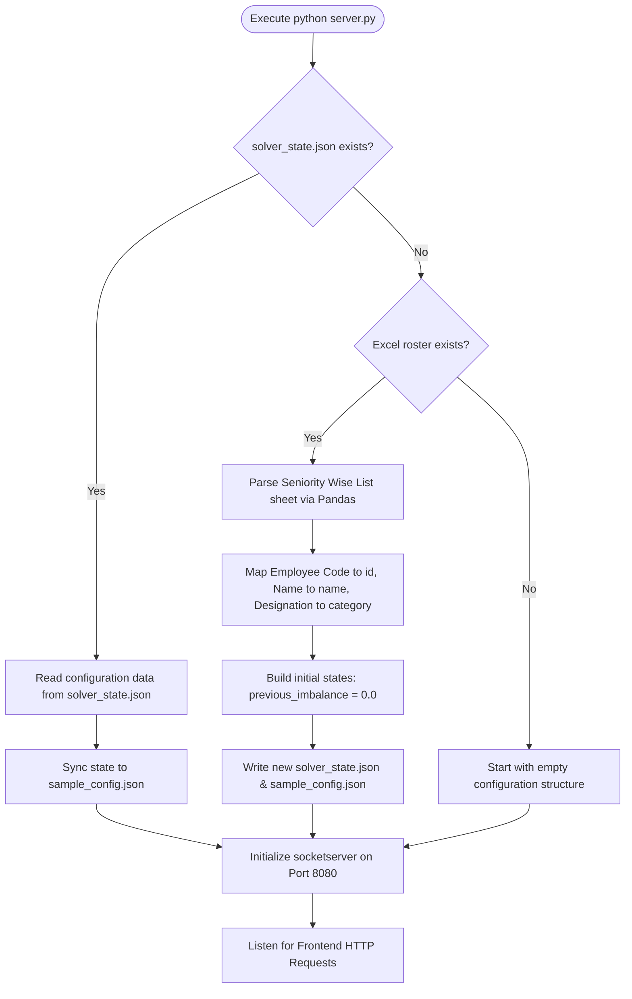
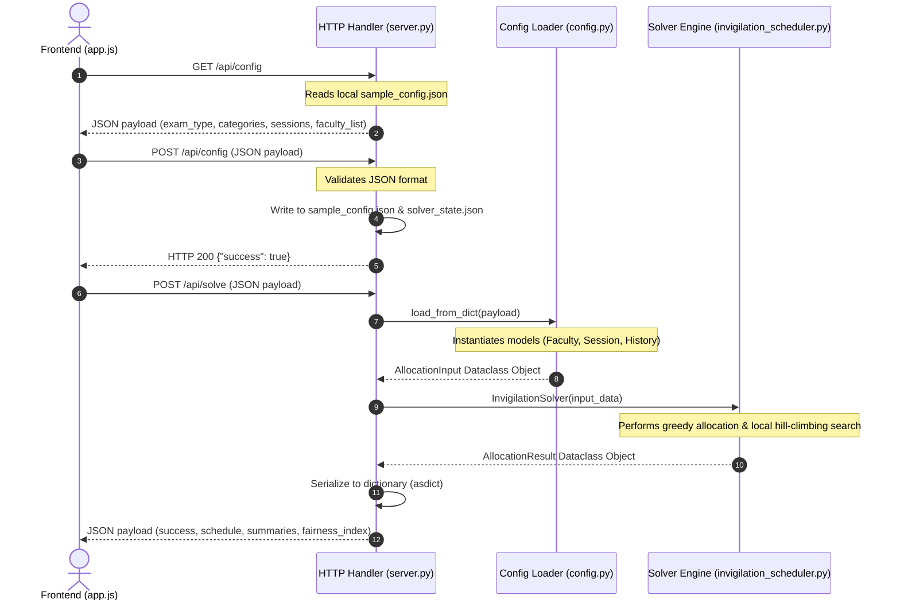
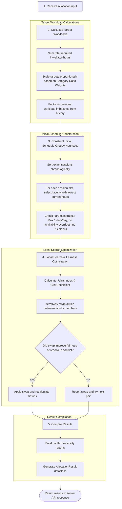

# Backend Code Workflow & Optimization Mechanics

This document provides a detailed technical walkthrough of the backend execution flow, including server startup bootstrapping, REST API endpoint lifecycles, and the core algorithmic solver pipeline.

---

## 1. High-Level Server Initialization Flow

When `python server.py` runs, it executes the state bootstrap procedure before listening to incoming API requests:

---

## 2. API Endpoint Lifecycle & Requests Flow

The server processes incoming REST APIs using three primary routes:

---

## 3. The Invigilation Solver Algorithmic Pipeline

Inside `invigilation_scheduler.py`, the core optimization algorithm operates in four distinct execution phases:

