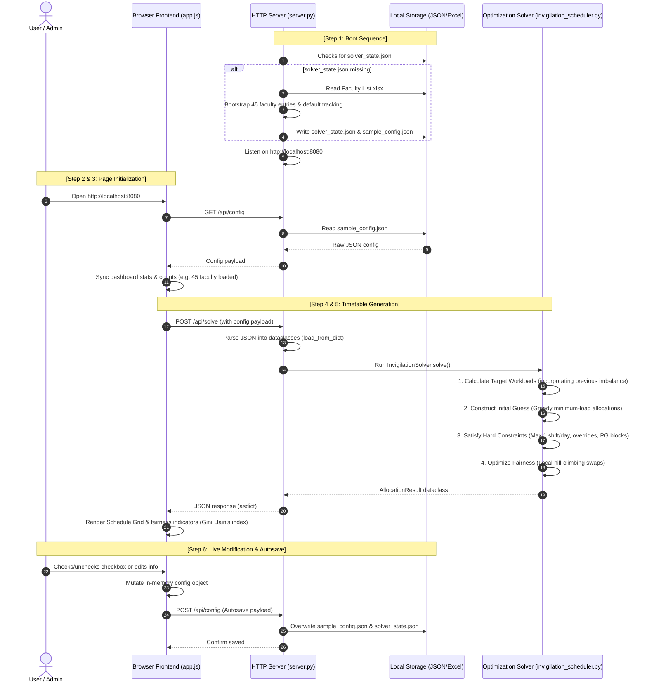

# End-to-End Current System Execution Workflow

This document walks through exactly what the current codebase (frontend and backend) does at each step, traceably from the moment the server boots up to the rendering of the final optimized schedule grid in the browser.

---

## The Complete End-to-End Workflow Diagram

---

## Detailed Step-by-Step Execution Breakdown

### Step 1: Server Startup & Excel Bootstrapping (`server.py`)
*   **Execution:** You launch the server via `python server.py`.
*   **Action:** 
    1.  The `bootstrap_state()` engine checks if `solver_state.json` exists in your folder.
    2.  If missing, it opens the spreadsheet `"Faculty List (Emp. Code, Phone No. and E-mail ID).xlsx"` and parses the `'Seniority Wise List'` sheet.
    3.  It maps the column data: employee code (string id), name, and designations (Professor, Associate Professor, Assistant Professor).
    4.  It constructs default tracking records (setting `previous_imbalance = 0.0` for all 45 members).
    5.  It merges these rosters with the configured exam session structures and writes out two updated storage files: `solver_state.json` (state backup) and `sample_config.json` (current config).
    6.  It binds to TCP port `8080` and begins listening for HTTP requests.

### Step 2: Browser Loads Dashboard Resources (`index.html` & `app.js`)
*   **Execution:** You navigate your browser to `http://localhost:8080`.
*   **Action:** The server returns `index.html` (layout and structure), `index.css` (design styles), and `app.js` (application state controller) to the browser.

### Step 3: Fetching Config & Synchronizing UI (`app.js` $\rightarrow$ `/api/config`)
*   **Execution:** Browser loads `app.js` and fires the `DOMContentLoaded` event.
*   **Action:** 
    1.  `app.js` issues a `GET /api/config` HTTP request to retrieve the startup state.
    2.  The backend server reads `sample_config.json` and responds with the raw configuration JSON data.
    3.  `app.js` normalizes the properties (ensuring `category_name` and `category` match), updates the UI elements (updating sidebar logo to `BIT MESRA`, showing the 45 loaded faculty members and exam sessions on stats cards).
    4.  It then triggers an initial silent run of the scheduler to construct the baseline timetable grid.

### Step 4: Invoking the Scheduler Engine (`app.js` $\rightarrow$ `/api/solve`)
*   **Execution:** You click **Run Allocation** on the dashboard.
*   **Action:**
    1.  `app.js` gathers the active parameters and sends a `POST /api/solve` request to the backend API containing the complete configuration.
    2.  The backend server's `handle_post_solve()` handler receives the JSON text.
    3.  It converts this dictionary into Python objects (`AllocationInput`) using the `load_from_dict()` converter.
    4.  It initializes a new `InvigilationSolver` instance with this input and calls the `solve()` method.

### Step 5: Optimization & Swap Iteration (`invigilation_scheduler.py`)
*   **Execution:** The solver runs the optimization pipeline.
*   **Action:**
    1.  **Workload Targeting:** Computes target duties for each faculty member. Junior Assistant Professors get higher targets than Professors (scaled by ratio weights: e.g., 4:2), adjusted for past imbalances (adding +n hours if they were overloaded historically).
    2.  **Greedy Initial Allocation:** Sorts sessions chronologically. For each slot, it assigns the faculty member who currently has the lowest accumulated load.
    3.  **Constraint Filtering:** Ensures every assignment satisfies three hard constraints:
        *   No faculty is assigned more than 1 duty on the same day.
        *   No faculty is assigned during their marked availability overrides.
        *   No faculty is assigned during their PG timetable lecture blocks.
    4.  **Hill-Climbing Swap Optimization:** The solver picks pairs of assigned duties and tests swapping them. If the swap reduces workload inequality (improving Jain's Index or lowering the Gini Coefficient) or resolves a constraint conflict, the swap is locked. Otherwise, it is reverted. This runs iteratively until no further improvements are possible.

### Step 6: Timetable Rendering (`app.js` $\rightarrow$ UI Layout)
*   **Execution:** The backend returns the `AllocationResult` back to the browser.
*   **Action:** 
    1.  The backend `server.py` serializes the solver dataclass output into JSON using `asdict()` and returns it with HTTP 200.
    2.  `app.js` receives the results.
    3.  It loops through the schedule and updates each grid cell on the timetable layout with the course codes, rooms, and assigned faculty names.
    4.  It renders the workload indicator charts, fairness meters, and update reports at the bottom.

### Step 7: Autosave Trigger & State Persistence (UI $\rightarrow$ `/api/config`)
*   **Execution:** You check/uncheck a faculty availability checkbox, edit weights, or modify a name.
*   **Action:**
    1.  The event listener (`toggleFacultyUnavail`, `updateFacultyField`, etc.) immediately mutates the local Javascript `activeConfig` object.
    2.  It automatically fires a silent `POST /api/config` containing the updated dataset.
    3.  The backend server writes this updated dictionary back to `sample_config.json` and `solver_state.json`.
    4.  If you refresh the browser or restart the backend, the exact same state is loaded, preventing any data loss.
