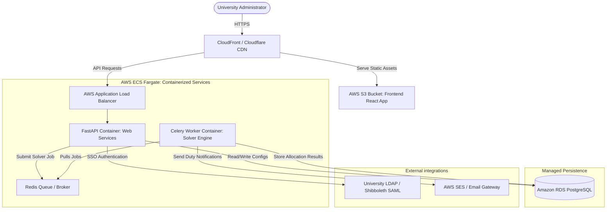

# Production Architecture & Deployment Roadmap
## BIT MESRA Invigilation Duty Allocation System

This document outlines the architectural roadmap, technology stack, and step-by-step deployment strategy required to transition the BIT MESRA Invigilation Scheduler from a local script into a production-grade, highly available, secure cloud application.

---

## 1. System Architecture Evolution

To support concurrent university users, ensure persistent audit logging, and decouple heavy solver computations from user interaction, we must move from a **single-process file-backed architecture** to a **decoupled, event-driven service architecture**.



---

## 2. Decoupled Production Technology Stack

| Tier | Component | Selection | Rationale |
| :--- | :--- | :--- | :--- |
| **Frontend** | Framework & UI | **React.js (Vite / Next.js) + TailwindCSS** | Modern SPA structure, modular UI components, robust routing, and state management (Redux/Zustand) for dynamic configurations. |
| **Backend API** | Web Framework | **FastAPI (Python)** | Asynchronous, natively parses Pydantic models (data validation matching our dataclasses), automatically generates OpenAPI/Swagger documentation, and provides excellent performance. |
| **Computation** | Async Tasks | **Celery + Redis** | The NP-hard solver calculations (Greedy + Local Search) can take time. Decoupling the solver into a background Celery worker ensures the API remains responsive without timeouts. |
| **Database** | Database Engine | **PostgreSQL (AWS RDS)** | Relational schemas to map complex faculty overrides, historical metrics, and session schedules. Transactions ensure data integrity. |
| **Authentication**| SSO/RBAC | **OAuth2 / JWT + LDAP** | Connects directly to BIT Mesra's official LDAP/Active Directory for admin logins, enforcing Role-Based Access Control (RBAC). |

---

## 3. Step-by-Step Deployment Blueprint

### Step 1: Containerization (Dockerization)
We package the application into isolated containers to ensure environment parity between local development and cloud production.

*   **API Dockerfile:** Multi-stage build running Python 3.11 with FastAPI.
*   **Worker Dockerfile:** Matches the API environment but runs the Celery worker command targeting `invigilation_scheduler.py`.
*   **Frontend Dockerfile:** Builds static React assets and packages them with Nginx.

### Step 2: Database Migration (SQL Schema)
We write database migrations (using **Alembic** in Python) to transition JSON files (`solver_state.json`) to database tables:
*   `faculties` (stores credentials, emp codes, designations, configurations).
*   `sessions` (exam blocks, days, requirements).
*   `allocations` (persisted outputs of the solver runs).
*   `availability_constraints` & `pg_blocks` (associated lists).

### Step 3: CI/CD Pipeline Setup (GitHub Actions / GitLab CI)
Automate testing, building, and deployment phases:
```mermaid
polyline
    Start [Code Push] --> Test [Run PyTest & Lints]
    Test --> Build [Build Docker Images]
    Build --> ECR [Push to AWS ECR Registry]
    ECR --> Deploy [Trigger ECS Fargate Service Redeployment]
```

### Step 4: Infrastructure provisioning (Infrastructure as Code)
Using **Terraform** or **AWS CloudFormation** to provision:
1.  **VPC & Subnets:** Isolated private subnets for the database and redis; public subnets for the ALB.
2.  **AWS ECS Fargate:** Serverless container compute scaling API and worker tasks dynamically.
3.  **Amazon RDS (PostgreSQL):** Configured with automated backups and multi-AZ failover.

---

## 4. Advanced Solver Engine Optimizations

To ensure the deployment handles future load (e.g., thousands of faculty members across departments), we implement the following optimization paths:

1.  **Solver caching:** Store successful solver schedules in Redis. If the configuration (sessions/faculties list) hasn't changed, serve the cached schedule instantly.
2.  **Horizontal Worker Scaling:** Configure ECS to spin up additional Celery workers when the scheduling period starts (high queue load) and scale down to zero off-season.
3.  **Partial Solver Streaming:** Implement WebSockets in FastAPI to stream intermediate feasibility diagnostics (like partial coverage reports and fairness indexes) to the UI in real-time as the Hill-Climbing algorithm runs.

---

## 5. Implementation Roadmap

### Phase 1: Decoupling (2 Weeks)
*   Deconstruct `server.py` into a modular FastAPI structure.
*   Migrate frontend state logic from `app.js` to React hooks and components.
*   Decouple the solver execution class into a Celery task.

### Phase 2: Schema Design & Persistence (1.5 Weeks)
*   Define the PostgreSQL schema and migrate current local `solver_state.json` templates.
*   Replace file system reads/writes in the API with SQLAlchemy repository operations.

### Phase 3: Auth & Admin Controls (1 Week)
*   Implement JWT-based session auth.
*   Develop user administration settings panel for Department Heads to upload their custom Excel lists directly from the browser.

### Phase 4: DevOps & Launch (1 Week)
*   Write Terraform manifests.
*   Integrate GitHub Actions pipeline.
*   Perform Stress Testing (simulating a run with 200+ faculty members and 50+ sessions).
