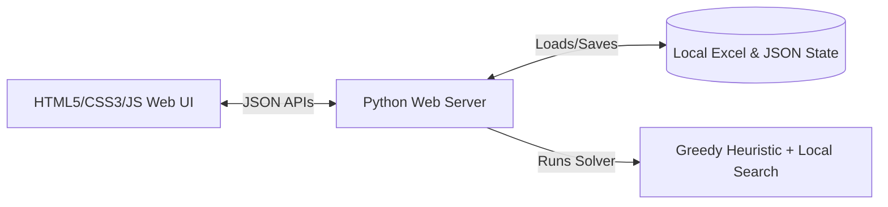

# Executive Summary: Invigilation Duty Allocation System

---

## Part 1: Project Overview & Core Implementation (1 Page)

### 1. The Core Problem
Universities face complex scheduling challenges during mid-sem and end-sem exam periods. Assigning invigilators manually leads to scheduling conflicts, coverage gaps, and structural inequality (e.g., junior faculty getting overloaded while senior faculty get lighter loads).

The **Invigilation Duty Allocation System** solves this by formulating duty scheduling as an optimization problem constrained by university policies, seniority-based load expectations, and individual availability.

### 2. High-Level System Architecture
The application runs as a lightweight, decoupled local web service:
*   **Web Dashboard (Frontend):** A premium, light-mode SPA built using HTML5, Vanilla CSS, and modern ES6 JavaScript (`app.js`). It allows administrators to import rosters, adjust settings, and view allocations in real-time.
*   **API Server (Backend):** A Python web server (`server.py`) powered by `http.server` that serves configurations and handles computational requests.
*   **Solver Engine (Core):** A dedicated scheduling framework (`invigilation_scheduler.py`) that implements mathematical fairness algorithms and operational heuristics.



### 3. Core Engine Mechanics & Optimization Strategy
The scheduling engine uses a hybrid optimization pipeline:
*   **Load Calculations:** Evaluates target loads for faculty members based on designation weights (e.g., Assistant Professors handle a higher proportion of duties than Professors) and historical load imbalances.
*   **Constraint Satisfaction:** Satisfies hard constraints (maximum of 1 shift per day per faculty, availability overrides, and PG lecture block conflicts).
*   **Optimization Pass:** Runs a greedy initialization followed by local hill-climbing search to maximize fairness, minimizing Jain's Fairness Index inequality and the Gini Coefficient.

---

## Part 2: Step-by-Step Implementation Guide (1 Page)

Transitioning this application from local configuration files to a production web app follows five structured phases:

```mermaid
matrix
    "Phase 1: Code Decoupling" -> "Phase 2: RDB Migration" -> "Phase 3: SSO Integration" -> "Phase 4: Containerization" -> "Phase 5: Cloud Orchestration"
```

### Phase 1: Decoupling and API Refactoring
1.  **Framework Upgrade:** Replace Python `http.server` with `FastAPI` to enable asynchronous handling, automatic Swagger documentation, and schema validations.
2.  **Frontend Modernization:** Port the vanilla `app.js` logic into `React.js` using `Vite`. Use component-based architecture for modal dialogs and the calendar grid.
3.  **Background Worker Setup:** Move solver runs off the main thread into a `Celery` task queue backed by `Redis` to prevent browser request timeouts.

### Phase 2: Relational Database Migration
1.  **DB Provisioning:** Connect a PostgreSQL database engine.
2.  **ORM Mapping:** Write `SQLAlchemy` models for `Faculty`, `Session`, `Schedule`, and `History`.
3.  **Bootstrap Scripting:** Use `Alembic` database migrations to parse the master Excel sheet ("Faculty List (Emp. Code, Phone No. and E-mail ID).xlsx") and import the baseline faculty roster into the tables.

### Phase 3: Authenticated Admin Controls & SSO
1.  **Single Sign-On:** Integrate university identity providers via `SAML` / `OIDC`.
2.  **Role-Based Access Control (RBAC):** Restrict modification routes (adding faculty, editing sessions) to authorized administrators.

### Phase 4: Containerization & CI/CD Pipeline
1.  **Dockerization:** Build multi-stage `Dockerfiles` for the frontend (Nginx hosting static files), the API server (FastAPI), and the task runner (Celery).
2.  **Automated Pipeline:** Set up GitHub Actions to run linters/tests and push verified Docker images to AWS ECR.

### Phase 5: Cloud Deployment & Infrastructure
1.  **Infrastructure as Code:** Write Terraform manifests to provision a secure VPC, ALB, and ECS Fargate cluster on AWS.
2.  **Deployment:** Deploy ECS services running behind an Application Load Balancer with SSL/TLS certificates.
